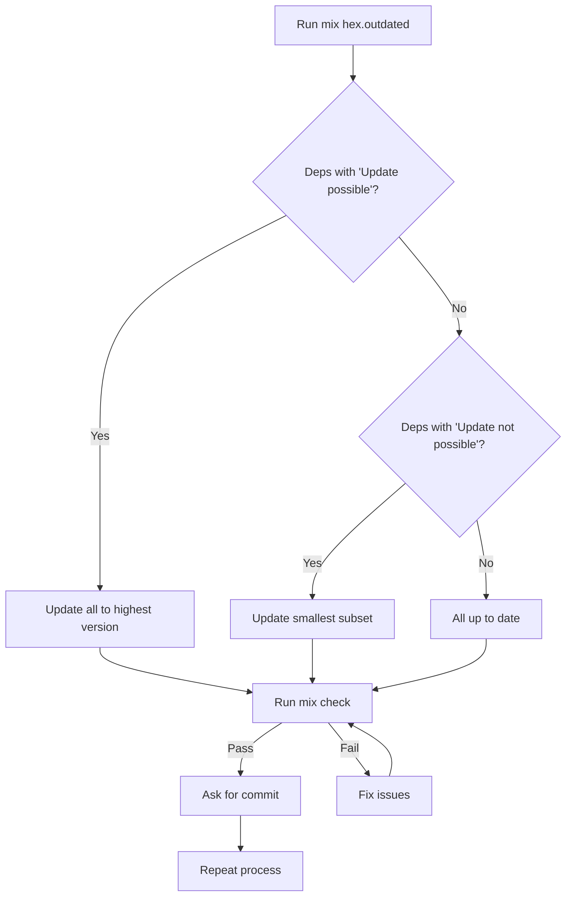

# Upgrade Dependencies

## Step 1: Check for Updates

```
mix hex.outdated
```

## Step 2: Decision Tree

```
Are there deps with "Update possible"?
├── YES → Update all to highest possible version
└── NO → Are there deps with "Update not possible"?
    ├── YES → Update smallest subset to newest versions
    └── NO → All dependencies are up to date
```

## Step 3: Validate Changes

```
mix check
```

## Step 4: Completion

- ✅ If `mix check` passes → Stop and ask for commit
- ❌ If `mix check` fails → Fix issues, then repeat from Step 3

---

### Alternative: Flowchart Style


